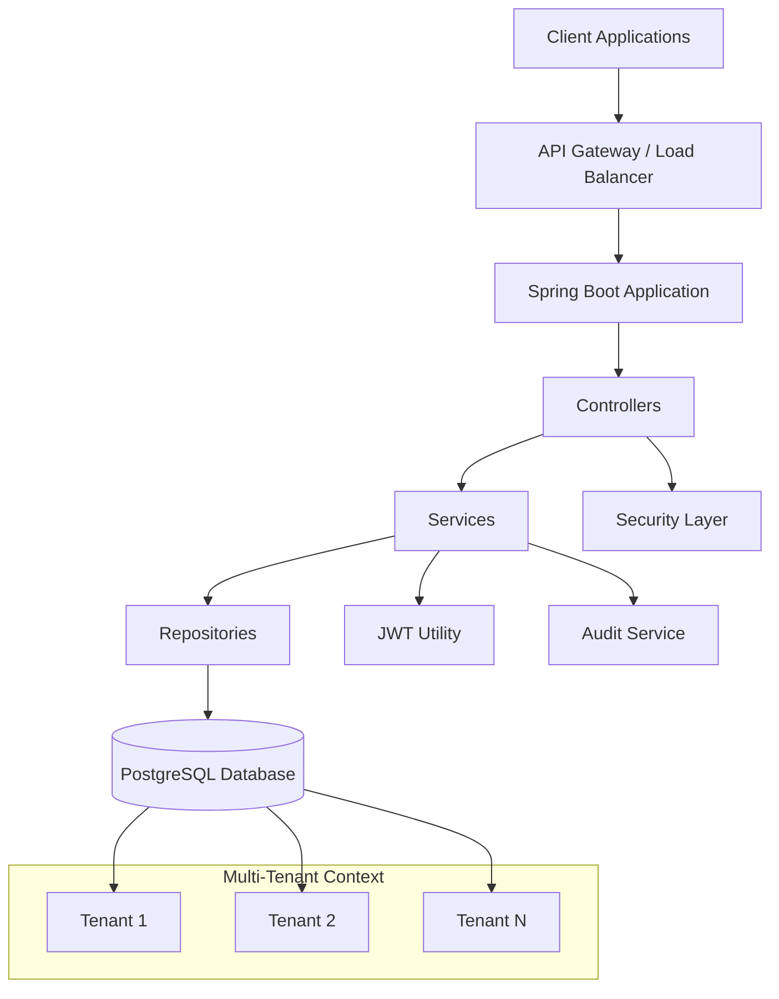

# Access Layer API

## What This Is

The Access Layer API is a multi-tenant backend service built with Spring Boot that provides secure access management for applications. It handles user authentication, authorization, tenant management, and audit logging to support scalable, secure multi-tenant architectures.

## Architecture Diagram



This diagram illustrates the high-level architecture of the Access Layer API, showing the flow from client requests through the Spring Boot layers to the database, with multi-tenant support and security components.

## Features

- **Authentication & Authorization**: JWT-based login and token validation
- **User Management**: Create and retrieve users within tenant contexts
- **Tenant Management**: Multi-tenant support with tenant creation and listing
- **Audit Logging**: Comprehensive logging of system activities per tenant
- **Security**: Role-based access control and secure API endpoints
- **Database Integration**: PostgreSQL with JPA/Hibernate for data persistence

## Tech Stack

- **Framework**: Spring Boot 4.0.4
- **Language**: Java 21
- **Database**: PostgreSQL
- **ORM**: Spring Data JPA with Hibernate
- **Security**: JSON Web Tokens (JWT)
- **Documentation**: SpringDoc OpenAPI (Swagger)
- **Build Tool**: Gradle
- **Containerization**: Docker
- **Utilities**: Lombok for boilerplate reduction

## Live API Link

[Access Layer API](https://access-layer.onrender.com)

## Swagger Link

[API Documentation](https://access-layer.onrender.com/swagger-ui.html)

*For local development, access Swagger UI at: http://localhost:8080/swagger-ui.html*

## Demo Steps

### Prerequisites

- Java 21 or higher
- PostgreSQL database
- Gradle (or use included Gradle wrapper)

### Local Setup

1. **Clone the repository**
   ```bash
   git clone <repository-url>
   cd access-layer
   ```

2. **Configure Environment Variables**

   Create a `.env` file or set environment variables:
   ```bash
   export DB_URL=jdbc:postgresql://localhost:5432/accesslayer
   export DB_USERNAME=your_db_username
   export DB_PASSWORD=your_db_password
   export JWT_SECRET=your_jwt_secret_key
   export PORT=8080
   ```

3. **Set up PostgreSQL Database**

   Create a database named `accesslayer` in PostgreSQL.

4. **Run the Application**

   Using Gradle wrapper:
   ```bash
   ./gradlew bootRun
   ```

   Or build and run:
   ```bash
   ./gradlew build
   java -jar build/libs/access-layer-0.0.1-SNAPSHOT.jar
   ```

5. **Access the Application**

   - API Base URL: http://localhost:8080
   - Swagger UI: http://localhost:8080/swagger-ui.html

### Docker Setup

1. **Build Docker Image**
   ```bash
   docker build -t access-layer .
   ```

2. **Run with Docker**
   ```bash
   docker run -p 8080:8080 \
     -e DB_URL=jdbc:postgresql://host.docker.internal:5432/accesslayer \
     -e DB_USERNAME=your_db_username \
     -e DB_PASSWORD=your_db_password \
     -e JWT_SECRET=your_jwt_secret_key \
     access-layer
   ```

### API Usage Examples

1. **Create a Tenant**
   ```bash
   curl -X POST http://localhost:8080/tenants \
     -H "Content-Type: application/json" \
     -d '{"name": "Example Corp", "description": "Example tenant"}'
   ```

2. **Login**
   ```bash
   curl -X POST http://localhost:8080/auth/login \
     -H "Content-Type: application/json" \
     -d '{"username": "admin", "password": "password"}'
   ```

3. **Create User** (requires Authorization header from login)
   ```bash
   curl -X POST http://localhost:8080/users \
     -H "Content-Type: application/json" \
     -H "Authorization: Bearer <jwt-token>" \
     -d '{"username": "newuser", "email": "user@example.com"}'
   ```

### Testing

Run tests with:
```bash
./gradlew test
```

View test reports in `build/reports/tests/test/index.html`